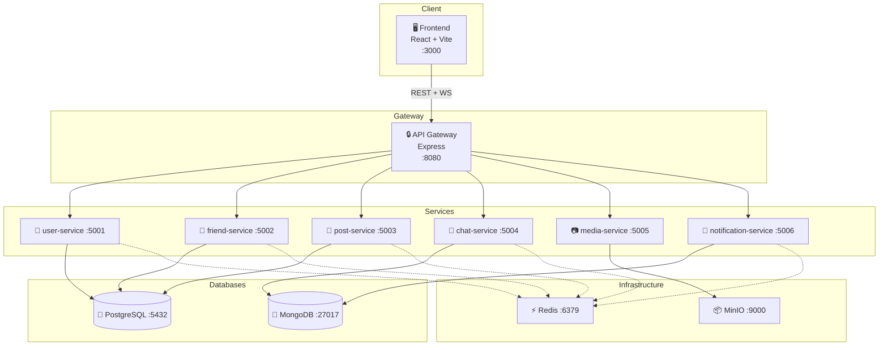

# SocialHub — Nền tảng Mạng Xã Hội Microservices

> Nền tảng mạng xã hội cho phép người dùng kết nối, chia sẻ nội dung, nhắn tin realtime và tương tác trong thời gian thực. Xây dựng theo kiến trúc microservices với Domain-Driven Design.

> **New to this repo?** See [`GETTING_STARTED.md`](GETTING_STARTED.md) for setup instructions, workflow guide, and submission checklist.

---

## Team Members

| Name | Student ID | Role | Contribution |
|------|------------|------|-------------|
|      |            |      |             |

---

## Features

- 🔐 **Xác thực & Profile**: Đăng ký, đăng nhập (JWT), quản lý profile, tìm kiếm user
- 🤝 **Kết bạn**: Gửi/chấp nhận/từ chối lời mời, danh sách bạn bè, gợi ý bạn bè
- 📝 **Bài đăng**: Tạo/sửa/xóa bài, like, comment, chia sẻ, newsfeed (cached)
- 💬 **Nhắn tin**: Chat 1-1, nhóm chat, realtime qua Socket.IO, typing indicator
- 📷 **Media**: Upload ảnh lên MinIO, presigned URL (xác thực, 15 phút)
- 🔔 **Thông báo**: Realtime push notifications qua Socket.IO

---

## Architecture



| Component | Responsibility | Tech Stack | Port |
|-----------|----------------|------------|------|
| **Frontend** | Single-page application | React + Vite, Socket.IO Client | 3000 |
| **API Gateway** | Routing, JWT validation, rate limiting | Node.js (Express) | 8080 |
| **user-service** | Auth (JWT), profile, user search | Node.js (Express), bcrypt | 5001 |
| **friend-service** | Friend requests, friendship, suggestions | Node.js (Express) | 5002 |
| **post-service** | Posts, feed, like, comment, share | Node.js (Express) | 5003 |
| **chat-service** | 1-1 messaging, group chat, realtime | Node.js (Express), Socket.IO | 5004 |
| **media-service** | Upload ảnh, presigned URL | Node.js (Express), MinIO SDK | 5005 |
| **notification-service** | Event consumer, push notifications | Node.js (Express), Socket.IO | 5006 |
| **PostgreSQL** | Users, posts, friendships | PostgreSQL 16 | 5432 |
| **MongoDB** | Messages, notifications | MongoDB 7 | 27017 |
| **Redis** | Cache, pub/sub, JWT blacklist | Redis 7 | 6379 |
| **MinIO** | Object storage (images) | MinIO S3 | 9000 |

---

## Quick Start

```bash
# 1. Copy environment variables
cp .env.example .env

# 2. Build and run all services
docker compose up --build

# 3. Verify
curl http://localhost:8080/health          # Gateway
curl http://localhost:5001/health          # user-service
curl http://localhost:5002/health          # friend-service
curl http://localhost:5003/health          # post-service
curl http://localhost:5004/health          # chat-service
curl http://localhost:5005/health          # media-service
curl http://localhost:5006/health          # notification-service
curl http://localhost:3000                 # Frontend
```

> For full setup instructions, prerequisites, and development commands, see [`GETTING_STARTED.md`](GETTING_STARTED.md).

---

## Documentation

| Document | Description |
|----------|-------------|
| [`GETTING_STARTED.md`](GETTING_STARTED.md) | Setup, workflow, submission checklist |
| [`docs/analysis-and-design-ddd.md`](docs/analysis-and-design-ddd.md) | Analysis & Design — Domain-Driven Design approach |
| [`docs/architecture.md`](docs/architecture.md) | Architecture patterns, components & deployment |
| [`docs/api-specs/`](docs/api-specs/) | OpenAPI 3.0 specifications for each service |

### API Specs

| Service | Spec File |
|---------|-----------|
| user-service | [`user-service.yaml`](docs/api-specs/user-service.yaml) |
| friend-service | [`friend-service.yaml`](docs/api-specs/friend-service.yaml) |
| post-service | [`post-service.yaml`](docs/api-specs/post-service.yaml) |
| chat-service | [`chat-service.yaml`](docs/api-specs/chat-service.yaml) |
| media-service | [`media-service.yaml`](docs/api-specs/media-service.yaml) |
| notification-service | [`notification-service.yaml`](docs/api-specs/notification-service.yaml) |

