# Analysis and Design — Domain-Driven Design Approach

> **Project**: SocialHub — Nền tảng Mạng Xã Hội
> **Scope**: Hệ thống hoàn chỉnh — bao gồm kết bạn, đăng bài, nhắn tin, nhóm chat, thông báo, quản lý media.
>
> **Approach**: Domain-Driven Design — khám phá service boundaries thông qua domain knowledge và business semantics.

**References:**
1. *Domain-Driven Design: Tackling Complexity in the Heart of Software* — Eric Evans
2. *Microservices Patterns: With Examples in Java* — Chris Richardson
3. *Designing Data-Intensive Applications* — Martin Kleppmann

---

### Progression Overview

| Step | What you do | Output |
|------|------------|--------|
| **1.1** | Define the System Domain | Domain overview, actors, scope |
| **1.2** | Survey existing systems & tech choices | System inventory |
| **1.3** | State non-functional requirements | NFR table |
| **2.1** | Build a shared domain vocabulary | Ubiquitous Language glossary |
| **2.2** | Discover Domain Events via Event Storming | Chronological event list |
| **2.3** | Identify Commands and Actors | Command → Event mapping |
| **2.4** | Form Aggregates from related Commands/Events | Aggregate table with owned data |
| **2.5** | Draw Bounded Contexts around Aggregates | Bounded Context → service candidate |
| **2.6** | Map relationships between Bounded Contexts | Context Map diagram + relationship table |
| **2.7** | Design service interactions | Service composition diagrams |
| **3.1** | Specify service contracts | OpenAPI endpoint tables |
| **3.2** | Design internal service logic | Flowchart per service |

---

## Part 1 — Domain Discovery

### 1.1 System Domain Definition

- **Domain**: Mạng xã hội (Social Network Platform)
- **System Name**: SocialHub
- **Description**: Nền tảng mạng xã hội cho phép người dùng kết nối, chia sẻ nội dung, nhắn tin và tương tác trong thời gian thực.
- **Actors**:
  - **User (Người dùng)**: Đăng ký, đăng nhập, quản lý profile, kết bạn, đăng bài, nhắn tin, tham gia nhóm chat
  - **Admin (Quản trị viên)**: Quản lý hệ thống, moderate nội dung
- **Scope**: Hệ thống hoàn chỉnh bao gồm:
  1. Quản lý tài khoản & xác thực (đăng ký, đăng nhập, profile)
  2. Mạng lưới bạn bè (gửi/chấp nhận/từ chối lời mời, gợi ý bạn bè)
  3. Nội dung (đăng bài, like, comment, chia sẻ, newsfeed)
  4. Nhắn tin (1-1, nhóm chat, realtime qua Socket.IO)
  5. Quản lý media (upload ảnh, presigned URL xác thực)
  6. Thông báo (in-app notifications, realtime)

**System Overview Diagram:**

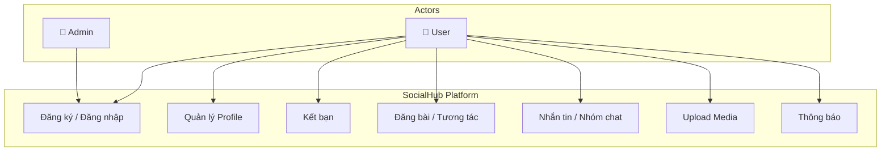

### 1.2 Existing Automation Systems

| System Name | Type | Current Role | Interaction Method |
|-------------|------|--------------|-------------------|
| *None* | — | — | — |

> *Dự án xây dựng từ đầu — không có hệ thống legacy.*

**Technology Choices (rationale):**

| Technology | Purpose | Justification |
|---|---|---|
| Node.js (Express) | Backend services | Non-blocking I/O phù hợp realtime chat, event-driven |
| React + Vite | Frontend SPA | Component-based UI, fast HMR, large ecosystem |
| PostgreSQL | Relational data (user, post, friendship) | ACID compliance, mature JSON support, complex queries |
| MongoDB | Document data (messages, chat) | Flexible schema cho messages, time-series queries |
| Socket.IO | Realtime communication | WebSocket abstraction, auto-reconnect, rooms/namespaces |
| MinIO | Object storage (images, media) | S3-compatible API, self-hosted, presigned URL support |
| Redis | Cache, pub/sub, session | In-memory speed, pub/sub cho Socket.IO adapter, sorted sets cho feed |

### 1.3 Non-Functional Requirements

| Requirement | Description |
|-------------|-------------|
| **Performance** | API response time < 200ms (p95). Realtime message delivery < 100ms. Newsfeed load < 500ms (cached). |
| **Security** | JWT-based authentication (access + refresh tokens). Presigned URL cho media (TTL 15 phút). HTTPS everywhere. Password hashed với bcrypt. Rate limiting trên Gateway. |
| **Scalability** | Horizontal scaling cho từng service independently. Redis adapter cho Socket.IO multi-instance. Stateless services (JWT, no server-side sessions). |
| **Availability** | Health checks cho tất cả services. Docker restart policy. Graceful shutdown handling. |
| **Data Consistency** | Eventual consistency giữa services qua Redis pub/sub events. Strong consistency trong từng service's database. |
| **Storage** | Media files tối đa 10MB/file. Presigned URL hết hạn sau 15 phút. MinIO bucket policy restrict direct access. |

---

## Part 2 — Strategic Domain-Driven Design

### 2.1 Ubiquitous Language

| Term | Definition | Example |
|------|-----------|---------|
| **User** | Một người dùng đã đăng ký tài khoản trong hệ thống | "User A đăng ký bằng email abc@mail.com" |
| **Profile** | Thông tin cá nhân của User (tên, avatar, bio) | "User cập nhật avatar trong Profile" |
| **Friend Request** | Lời mời kết bạn từ một User gửi tới User khác, trạng thái pending/accepted/rejected | "User A gửi Friend Request tới User B" |
| **Friendship** | Quan hệ bạn bè hai chiều giữa hai Users đã accepted | "User A và User B có Friendship" |
| **Post** | Bài đăng chứa text và/hoặc media, được tạo bởi một User | "User tạo Post với 2 ảnh" |
| **Like** | Hành động thể hiện sự yêu thích một Post | "User A Like Post của User B" |
| **Comment** | Phản hồi văn bản dưới một Post | "User A viết Comment trên Post" |
| **Share** | Hành động chia sẻ lại một Post lên tường của mình | "User A Share Post của User B" |
| **Feed** | Luồng bài đăng từ bạn bè, sắp xếp theo thời gian | "User xem Feed gồm Posts từ bạn bè" |
| **Conversation** | Cuộc hội thoại 1-1 giữa hai Users | "User A mở Conversation với User B" |
| **Group Chat** | Cuộc hội thoại nhiều người, có tên và danh sách thành viên | "User A tạo Group Chat '3A Friends'" |
| **Message** | Một tin nhắn trong Conversation hoặc Group Chat | "User A gửi Message 'Hello!' trong Conversation" |
| **Media Asset** | File ảnh/video được upload và lưu trữ trong hệ thống | "User upload Media Asset (avatar.jpg, 2MB)" |
| **Presigned URL** | URL có thời hạn để truy cập Media Asset, yêu cầu xác thực | "Media Service sinh Presigned URL cho ảnh, hết hạn sau 15 phút" |
| **Notification** | Thông báo tới User về một sự kiện (friend request, like, message mới) | "User B nhận Notification 'User A đã gửi lời mời kết bạn'" |
| **Online Presence** | Trạng thái online/offline của User, tracking qua Socket.IO | "User A đang Online (Online Presence = active)" |
| **JWT (Access Token)** | Token xác thực ngắn hạn (15 phút) để gọi API | "Gateway validate JWT trước khi route request" |
| **Refresh Token** | Token dài hạn (7 ngày) để lấy Access Token mới | "Client dùng Refresh Token để lấy Access Token mới" |
| **Typing Indicator** | Tín hiệu cho biết đối phương đang gõ tin nhắn | "User A thấy Typing Indicator từ User B" |
| **Member** | Một User trong Group Chat, có role (admin/member) | "User A là Member với role admin trong Group Chat" |

### 2.2 Event Storming — Domain Events

| # | Domain Event | Description | Subdomain |
|---|-------------|-------------|-----------|
| 1 | **UserRegistered** | User hoàn tất đăng ký tài khoản mới | Identity |
| 2 | **UserLoggedIn** | User đăng nhập thành công, JWT được cấp | Identity |
| 3 | **TokenRefreshed** | Access token mới được cấp từ refresh token | Identity |
| 4 | **UserLoggedOut** | User đăng xuất, token bị blacklist | Identity |
| 5 | **ProfileUpdated** | User cập nhật thông tin profile (tên, bio, avatar URL) | Identity |
| 6 | **AvatarChanged** | User thay đổi ảnh avatar | Identity |
| 7 | **FriendRequestSent** | User A gửi lời mời kết bạn tới User B | Social Graph |
| 8 | **FriendRequestAccepted** | User B chấp nhận lời mời kết bạn từ User A | Social Graph |
| 9 | **FriendRequestRejected** | User B từ chối lời mời kết bạn từ User A | Social Graph |
| 10 | **FriendRemoved** | User A hủy kết bạn với User B | Social Graph |
| 11 | **PostCreated** | User tạo bài đăng mới (text + media URLs) | Content |
| 12 | **PostUpdated** | User sửa nội dung bài đăng | Content |
| 13 | **PostDeleted** | User xóa bài đăng | Content |
| 14 | **PostLiked** | User A thích bài đăng của User B | Content |
| 15 | **PostUnliked** | User A bỏ thích bài đăng | Content |
| 16 | **CommentCreated** | User viết comment trên một Post | Content |
| 17 | **CommentDeleted** | User xóa comment | Content |
| 18 | **PostShared** | User A chia sẻ lại Post của User B | Content |
| 19 | **ConversationCreated** | Cuộc hội thoại 1-1 mới được tạo | Messaging |
| 20 | **MessageSent** | Tin nhắn được gửi trong Conversation/Group | Messaging |
| 21 | **MessageRead** | Tin nhắn được đánh dấu đã đọc | Messaging |
| 22 | **GroupChatCreated** | Nhóm chat mới được tạo | Messaging |
| 23 | **GroupMemberAdded** | Thành viên mới được thêm vào Group Chat | Messaging |
| 24 | **GroupMemberRemoved** | Thành viên bị xóa khỏi Group Chat | Messaging |
| 25 | **GroupChatUpdated** | Thông tin nhóm chat được cập nhật (tên, avatar) | Messaging |
| 26 | **MediaUploaded** | File media được upload thành công lên MinIO | Media |
| 27 | **MediaDeleted** | File media bị xóa khỏi MinIO | Media |
| 28 | **NotificationCreated** | Thông báo mới được tạo cho User | Notification |
| 29 | **NotificationRead** | User đánh dấu thông báo đã đọc | Notification |
| 30 | **NotificationsBatchRead** | User đánh dấu tất cả thông báo đã đọc | Notification |

### 2.3 Commands and Actors

| Command | Actor | Triggers Event(s) | Description |
|---------|-------|--------------------|-------------|
| **RegisterUser** | User | UserRegistered | Đăng ký tài khoản bằng email + password |
| **LoginUser** | User | UserLoggedIn | Đăng nhập bằng email + password → nhận JWT |
| **RefreshToken** | User | TokenRefreshed | Dùng refresh token để lấy access token mới |
| **LogoutUser** | User | UserLoggedOut | Đăng xuất → blacklist JWT |
| **UpdateProfile** | User | ProfileUpdated | Cập nhật tên, bio |
| **ChangeAvatar** | User | AvatarChanged | Upload ảnh avatar mới (qua media-service) |
| **SendFriendRequest** | User | FriendRequestSent, NotificationCreated | Gửi lời mời kết bạn |
| **AcceptFriendRequest** | User | FriendRequestAccepted, NotificationCreated | Chấp nhận lời mời kết bạn → tạo Friendship hai chiều |
| **RejectFriendRequest** | User | FriendRequestRejected | Từ chối lời mời kết bạn |
| **RemoveFriend** | User | FriendRemoved | Hủy kết bạn |
| **CreatePost** | User | PostCreated | Tạo bài đăng với text + media URLs |
| **UpdatePost** | User | PostUpdated | Sửa nội dung bài đăng (chỉ author) |
| **DeletePost** | User | PostDeleted | Xóa bài đăng (chỉ author) |
| **LikePost** | User | PostLiked, NotificationCreated | Thích một bài đăng |
| **UnlikePost** | User | PostUnliked | Bỏ thích bài đăng |
| **CreateComment** | User | CommentCreated, NotificationCreated | Viết comment trên Post |
| **DeleteComment** | User | CommentDeleted | Xóa comment (author hoặc post owner) |
| **SharePost** | User | PostShared, NotificationCreated | Chia sẻ lại bài đăng |
| **CreateConversation** | User | ConversationCreated | Bắt đầu cuộc hội thoại 1-1 mới |
| **SendMessage** | User | MessageSent, NotificationCreated | Gửi tin nhắn trong conversation/group |
| **MarkMessageRead** | User | MessageRead | Đánh dấu tin nhắn đã đọc |
| **CreateGroupChat** | User | GroupChatCreated | Tạo nhóm chat mới |
| **UpdateGroupChat** | User | GroupChatUpdated | Sửa tên/avatar nhóm (chỉ admin) |
| **AddGroupMember** | User | GroupMemberAdded, NotificationCreated | Thêm thành viên vào nhóm (chỉ admin) |
| **RemoveGroupMember** | User | GroupMemberRemoved | Xóa thành viên khỏi nhóm (admin) hoặc rời nhóm (member) |
| **UploadMedia** | User | MediaUploaded | Upload file ảnh lên MinIO |
| **DeleteMedia** | User | MediaDeleted | Xóa file ảnh khỏi MinIO |
| **MarkNotificationRead** | User | NotificationRead | Đánh dấu 1 thông báo đã đọc |
| **MarkAllNotificationsRead** | User | NotificationsBatchRead | Đánh dấu tất cả thông báo đã đọc |

### 2.4 Aggregates

| Aggregate | Root Entity | Commands | Domain Events | Key Business Rules |
|-----------|------------|----------|---------------|-------------------|
| **User** | User | RegisterUser, LoginUser, RefreshToken, LogoutUser | UserRegistered, UserLoggedIn, TokenRefreshed, UserLoggedOut | Email phải unique; password >= 8 ký tự; JWT access token TTL 15 phút, refresh token 7 ngày |
| **Profile** | Profile | UpdateProfile, ChangeAvatar | ProfileUpdated, AvatarChanged | Display name 2-50 ký tự; bio tối đa 500 ký tự; avatar phải là valid media URL |
| **FriendRequest** | FriendRequest | SendFriendRequest, AcceptFriendRequest, RejectFriendRequest | FriendRequestSent, FriendRequestAccepted, FriendRequestRejected | Không thể gửi lời mời cho chính mình; không thể gửi nếu đã là bạn; không thể gửi nếu đã có pending request |
| **Friendship** | Friendship | RemoveFriend | FriendRemoved | Friendship luôn hai chiều; xóa friendship cũng xóa cả hai phía |
| **Post** | Post | CreatePost, UpdatePost, DeletePost, SharePost | PostCreated, PostUpdated, PostDeleted, PostShared | Post phải có text hoặc media (không được rỗng cả hai); media URLs tối đa 10 ảnh; chỉ author mới sửa/xóa |
| **Interaction** | Like / Comment | LikePost, UnlikePost, CreateComment, DeleteComment | PostLiked, PostUnliked, CommentCreated, CommentDeleted | 1 user chỉ like 1 lần / post; comment tối đa 2000 ký tự; xóa comment: author hoặc post owner |
| **Conversation** | Conversation | CreateConversation, SendMessage, MarkMessageRead | ConversationCreated, MessageSent, MessageRead | 1-1 conversation unique giữa 2 users; chỉ participant mới gửi/đọc message |
| **GroupChat** | GroupChat | CreateGroupChat, UpdateGroupChat, AddGroupMember, RemoveGroupMember | GroupChatCreated, GroupChatUpdated, GroupMemberAdded, GroupMemberRemoved | Nhóm tối thiểu 2 thành viên; người tạo là admin; chỉ admin thêm/xóa thành viên |
| **MediaAsset** | MediaAsset | UploadMedia, DeleteMedia | MediaUploaded, MediaDeleted | File tối đa 10MB; chỉ cho phép image types (jpg, png, gif, webp); presigned URL TTL 15 phút |
| **Notification** | Notification | MarkNotificationRead, MarkAllNotificationsRead | NotificationCreated, NotificationRead, NotificationsBatchRead | Notification chỉ gửi cho user liên quan; types: friend_request, friend_accepted, post_liked, post_commented, post_shared, message_received, group_added |

### 2.5 Bounded Contexts

| Bounded Context | Aggregates Included | Responsibility | Service Candidate | Database |
|-----------------|---------------------|----------------|-------------------|----------|
| **Identity & Access** | User, Profile | Quản lý toàn bộ lifecycle người dùng: đăng ký, xác thực (JWT), quản lý profile, tìm kiếm user | `user-service` | PostgreSQL |
| **Social Graph** | FriendRequest, Friendship | Quản lý quan hệ bạn bè: gửi/chấp nhận/từ chối lời mời, danh sách bạn bè, bạn chung, gợi ý kết bạn | `friend-service` | PostgreSQL |
| **Content** | Post, Interaction (Like, Comment) | Quản lý nội dung: CRUD bài đăng, like/unlike, comment, chia sẻ, newsfeed (cached) | `post-service` | PostgreSQL |
| **Messaging** | Conversation, GroupChat | Quản lý tin nhắn realtime: hội thoại 1-1, nhóm chat, lịch sử tin nhắn, typing indicator, online presence | `chat-service` | MongoDB |
| **Media** | MediaAsset | Quản lý file media: upload lên MinIO, generate presigned URL (xác thực), xóa file | `media-service` | MinIO (S3) |
| **Notification** | Notification | Quản lý thông báo: tạo notification khi có sự kiện, đánh dấu đã đọc, realtime push qua Socket.IO | `notification-service` | MongoDB |

> **Lý do 6 Bounded Contexts:**
> - **Identity vs Social Graph**: "User" trong Identity context là tài khoản + credentials, trong Social Graph là node trong graph bạn bè → ngữ nghĩa khác nhau.
> - **Content vs Messaging**: Post là nội dung public/friends-only với interactions (like, comment). Message là nội dung private 1-1/group. Patterns rất khác (feed vs realtime stream).
> - **Media riêng biệt**: I/O intensive, cần scale riêng. Xác thực presigned URL là cross-cutting concern.
> - **Notification riêng biệt**: Nhận events từ nhiều services khác nhau (friend, post, chat). Là consumer thuần túy — loose coupling.

### 2.6 Context Map

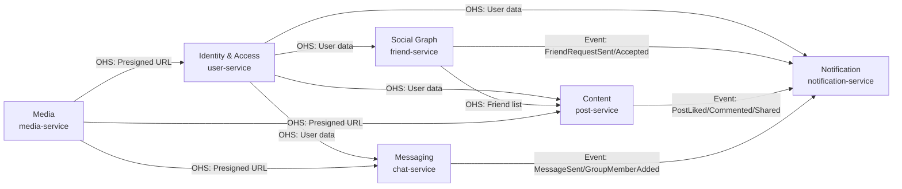

**Relationship Table:**

| Upstream | Downstream | Relationship Type | Data Exchanged |
|----------|------------|-------------------|----------------|
| Identity & Access | Social Graph | Open Host Service (OHS) | User ID, display name, avatar URL (REST call) |
| Identity & Access | Content | Open Host Service (OHS) | User ID, display name, avatar URL (REST call) |
| Identity & Access | Messaging | Open Host Service (OHS) | User ID, display name, avatar URL (REST call) |
| Identity & Access | Notification | Open Host Service (OHS) | User ID, display name (REST call) |
| Social Graph | Content | Open Host Service (OHS) | Friend list for feed generation (REST call) |
| Social Graph | Notification | Event-driven (Redis Pub/Sub) | FriendRequestSent, FriendRequestAccepted events |
| Content | Notification | Event-driven (Redis Pub/Sub) | PostLiked, CommentCreated, PostShared events |
| Messaging | Notification | Event-driven (Redis Pub/Sub) | MessageSent, GroupMemberAdded events |
| Media | Identity, Content, Messaging | Open Host Service (OHS) | Presigned URL, media metadata (REST call) |

> **Communication patterns:**
> - **Synchronous (REST)**: Khi downstream cần data ngay lập tức (ví dụ: post-service cần friend list để build feed).
> - **Asynchronous (Redis Pub/Sub)**: Khi upstream phát sinh event mà downstream xử lý bất đồng bộ (ví dụ: notification khi có like mới). Redis Pub/Sub được chọn thay vì Kafka/RabbitMQ vì đã có Redis trong stack và quy mô vừa phải.

### 2.7 Service Composition

**Flow 1: User đăng ký và thiết lập Profile**

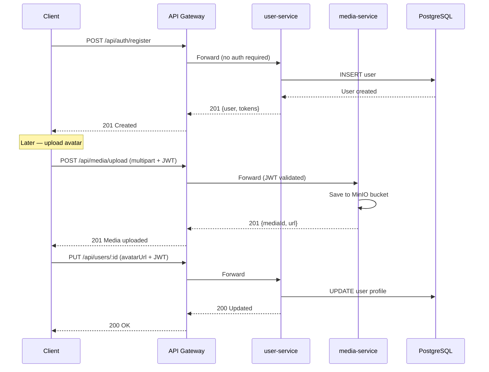

**Flow 2: Kết bạn**

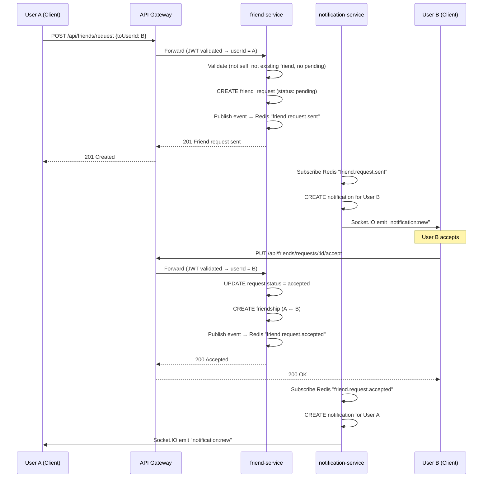

**Flow 3: Đăng bài + Tương tác (Like, Comment)**

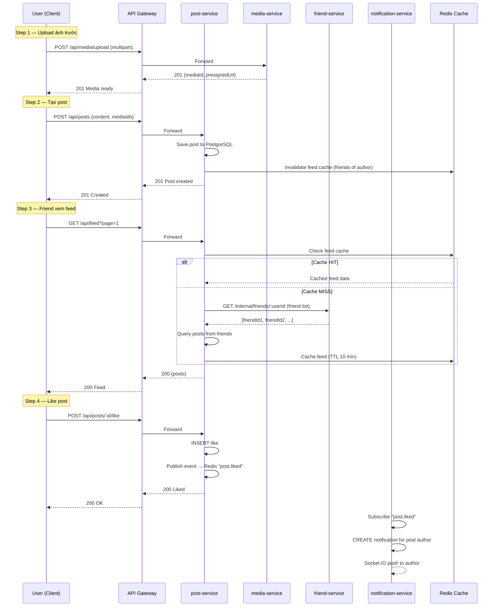

**Flow 4: Nhắn tin Realtime (1-1 & Group Chat)**

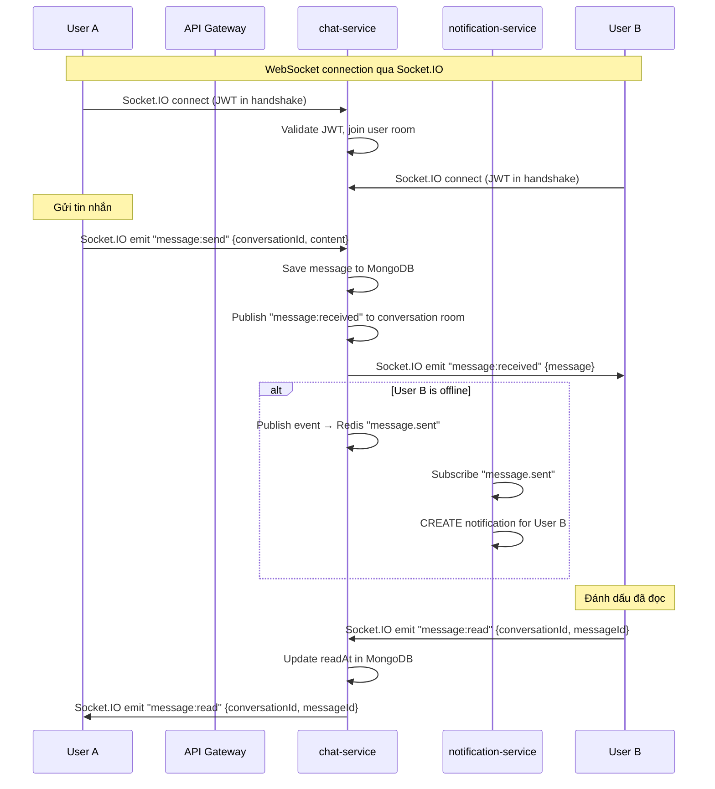

**Flow 5: Upload ảnh với Presigned URL (Xác thực)**

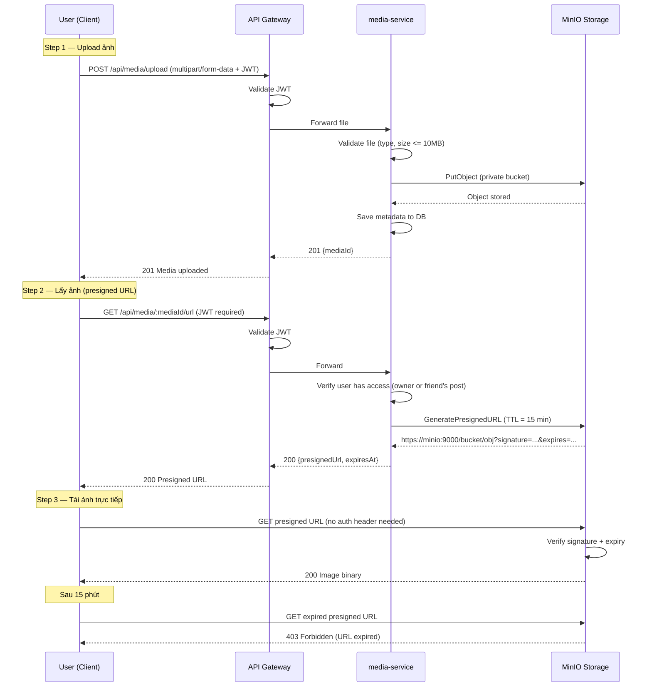

---

### Part 2 Summary — How DDD Steps Map to Service Candidates and API Endpoints

| DDD Step | Intermediate Output | What it contributes to |
|----------|---------------------|------------------------|
| **2.1** Ubiquitous Language | Shared glossary (20 terms) | Consistent naming across all services and APIs |
| **2.2** Domain Events (Event Storming) | 30 domain events | Evidence base for commands and service boundaries |
| **2.3** Commands + Actors | 28 commands with triggering actors | → **API endpoints** (each command ≈ one endpoint) |
| **2.4** Aggregates | 10 aggregates with owned data | → **Service boundaries** (aggregates cluster by context) |
| **2.5** Bounded Contexts | **→ 6 Service Candidates** | Each Bounded Context = one microservice |
| **2.6** Context Map | Upstream/downstream relationships | → Deployment topology and communication patterns |
| **2.7** Service Composition | Inter-service sequence diagrams | → Architecture diagram in `architecture.md` |
| **3.1** Contract Design | **→ API Endpoints** (final output) | OpenAPI specs in `docs/api-specs/` |

---

## Part 3 — Service-Oriented Design

### 3.1 Uniform Contract Design

Service Contract specification for each Bounded Context / service.
Full OpenAPI specs:
- [`docs/api-specs/user-service.yaml`](api-specs/user-service.yaml)
- [`docs/api-specs/friend-service.yaml`](api-specs/friend-service.yaml)
- [`docs/api-specs/post-service.yaml`](api-specs/post-service.yaml)
- [`docs/api-specs/chat-service.yaml`](api-specs/chat-service.yaml)
- [`docs/api-specs/media-service.yaml`](api-specs/media-service.yaml)
- [`docs/api-specs/notification-service.yaml`](api-specs/notification-service.yaml)

---

**user-service — Identity & Access:**

| Endpoint | Method | Description | Request Body | Response Codes |
|----------|--------|-------------|--------------|----------------|
| `/auth/register` | POST | Đăng ký tài khoản | `{email, password, displayName}` | 201, 400, 409 |
| `/auth/login` | POST | Đăng nhập | `{email, password}` | 200, 401 |
| `/auth/refresh` | POST | Refresh access token | `{refreshToken}` | 200, 401 |
| `/auth/logout` | POST | Đăng xuất (blacklist token) | — | 200, 401 |
| `/users/:id` | GET | Lấy profile user | — | 200, 404 |
| `/users/:id` | PUT | Cập nhật profile | `{displayName?, bio?, avatarUrl?}` | 200, 400, 403 |
| `/users/search` | GET | Tìm kiếm user | `?q=keyword&page=1&limit=20` | 200 |
| `/users/batch` | POST | Lấy nhiều users (internal) | `{userIds: [...]}` | 200 |

---

**friend-service — Social Graph:**

| Endpoint | Method | Description | Request Body | Response Codes |
|----------|--------|-------------|--------------|----------------|
| `/friends/request` | POST | Gửi lời mời kết bạn | `{toUserId}` | 201, 400, 409 |
| `/friends/requests` | GET | Danh sách lời mời pending | `?type=received\|sent&page&limit` | 200 |
| `/friends/requests/:id/accept` | PUT | Chấp nhận lời mời | — | 200, 404, 403 |
| `/friends/requests/:id/reject` | PUT | Từ chối lời mời | — | 200, 404, 403 |
| `/friends` | GET | Danh sách bạn bè | `?page&limit` | 200 |
| `/friends/:friendId` | DELETE | Hủy kết bạn | — | 200, 404 |
| `/friends/mutual/:userId` | GET | Bạn chung với user khác | — | 200 |
| `/friends/suggestions` | GET | Gợi ý kết bạn | `?limit=10` | 200 |
| `/friends/check/:userId` | GET | Kiểm tra trạng thái bạn bè | — | 200 |
| `/internal/friends/:userId` | GET | Friend IDs (internal only) | — | 200 |

---

**post-service — Content:**

| Endpoint | Method | Description | Request Body | Response Codes |
|----------|--------|-------------|--------------|----------------|
| `/posts` | POST | Tạo bài đăng | `{content, mediaIds?, visibility?}` | 201, 400 |
| `/posts/:id` | GET | Xem bài đăng | — | 200, 404 |
| `/posts/:id` | PUT | Sửa bài đăng | `{content?, mediaIds?}` | 200, 403, 404 |
| `/posts/:id` | DELETE | Xóa bài đăng | — | 200, 403, 404 |
| `/posts/user/:userId` | GET | Bài đăng của user | `?page&limit` | 200 |
| `/feed` | GET | News feed | `?page&limit&cursor` | 200 |
| `/posts/:id/like` | POST | Like bài đăng | — | 200, 404 |
| `/posts/:id/like` | DELETE | Unlike bài đăng | — | 200, 404 |
| `/posts/:id/comments` | GET | Lấy comments | `?page&limit` | 200 |
| `/posts/:id/comments` | POST | Tạo comment | `{content}` | 201, 400 |
| `/posts/:postId/comments/:commentId` | DELETE | Xóa comment | — | 200, 403, 404 |
| `/posts/:id/share` | POST | Chia sẻ bài đăng | `{content?}` | 201, 404 |

---

**chat-service — Messaging:**

| Endpoint | Method | Description | Request Body | Response Codes |
|----------|--------|-------------|--------------|----------------|
| `/conversations` | GET | Danh sách conversations | `?page&limit` | 200 |
| `/conversations` | POST | Tạo conversation 1-1 | `{participantId}` | 201, 400, 409 |
| `/conversations/:id/messages` | GET | Lịch sử tin nhắn | `?before&limit` (cursor-based) | 200, 403 |
| `/groups` | POST | Tạo nhóm chat | `{name, memberIds}` | 201, 400 |
| `/groups/:id` | GET | Thông tin nhóm | — | 200, 404 |
| `/groups/:id` | PUT | Sửa thông tin nhóm | `{name?, avatarUrl?}` | 200, 403 |
| `/groups/:id/members` | POST | Thêm thành viên | `{userId}` | 200, 403 |
| `/groups/:id/members/:userId` | DELETE | Xóa thành viên | — | 200, 403 |
| `/groups/:id/leave` | POST | Rời nhóm | — | 200 |

**Socket.IO Events (Realtime):**

| Event | Direction | Payload | Description |
|-------|-----------|---------|-------------|
| `message:send` | Client → Server | `{conversationId, content, type?}` | Gửi tin nhắn |
| `message:received` | Server → Client | `{message}` | Nhận tin nhắn mới |
| `message:read` | Client → Server | `{conversationId, messageId}` | Đánh dấu đã đọc |
| `message:read:ack` | Server → Client | `{conversationId, messageId, readBy}` | Xác nhận đã đọc |
| `typing:start` | Client → Server | `{conversationId}` | Đang gõ |
| `typing:stop` | Client → Server | `{conversationId}` | Ngừng gõ |
| `typing:indicator` | Server → Client | `{conversationId, userId}` | Hiển thị typing |
| `user:online` | Server → Client | `{userId}` | User online |
| `user:offline` | Server → Client | `{userId}` | User offline |

---

**media-service — Media:**

| Endpoint | Method | Description | Request Body | Response Codes |
|----------|--------|-------------|--------------|----------------|
| `/media/upload` | POST | Upload file (multipart) | `file` (form-data) | 201, 400, 413 |
| `/media/:id` | GET | Lấy metadata | — | 200, 404 |
| `/media/:id/url` | GET | Lấy presigned URL | — | 200, 403, 404 |
| `/media/:id` | DELETE | Xóa media | — | 200, 403, 404 |
| `/media/batch-urls` | POST | Batch presigned URLs | `{mediaIds: [...]}` | 200 |

> **Presigned URL Security Flow:**
> 1. Tất cả requests qua Gateway → **JWT required**
> 2. media-service verify quyền truy cập (owner hoặc có quyền xem)
> 3. Generate presigned URL từ MinIO với **TTL 15 phút**
> 4. Client dùng presigned URL tải ảnh trực tiếp từ MinIO
> 5. Sau TTL → URL hết hạn → `403 Forbidden`

---

**notification-service — Notification:**

| Endpoint | Method | Description | Request Body | Response Codes |
|----------|--------|-------------|--------------|----------------|
| `/notifications` | GET | Danh sách thông báo | `?page&limit&unreadOnly` | 200 |
| `/notifications/unread-count` | GET | Số thông báo chưa đọc | — | 200 |
| `/notifications/:id/read` | PUT | Đánh dấu 1 thông báo đã đọc | — | 200, 404 |
| `/notifications/read-all` | PUT | Đánh dấu tất cả đã đọc | — | 200 |

**Redis Pub/Sub Events (Consumed):**

| Channel | Source Service | Notification Type | Message to User |
|---------|---------------|-------------------|-----------------|
| `friend.request.sent` | friend-service | `friend_request` | "{User A} đã gửi lời mời kết bạn" |
| `friend.request.accepted` | friend-service | `friend_accepted` | "{User A} đã chấp nhận lời mời kết bạn" |
| `post.liked` | post-service | `post_liked` | "{User A} đã thích bài viết của bạn" |
| `post.commented` | post-service | `post_commented` | "{User A} đã bình luận bài viết của bạn" |
| `post.shared` | post-service | `post_shared` | "{User A} đã chia sẻ bài viết của bạn" |
| `message.sent` | chat-service | `new_message` | "{User A} đã gửi tin nhắn cho bạn" |
| `group.member.added` | chat-service | `group_added` | "Bạn đã được thêm vào nhóm {Group Name}" |

**Socket.IO Events (Pushed):**

| Event | Direction | Payload | Description |
|-------|-----------|---------|-------------|
| `notification:new` | Server → Client | `{notification}` | Push thông báo mới realtime |
| `notification:count` | Server → Client | `{unreadCount}` | Cập nhật số chưa đọc |

---

### 3.2 Service Logic Design

**user-service — RegisterUser:**

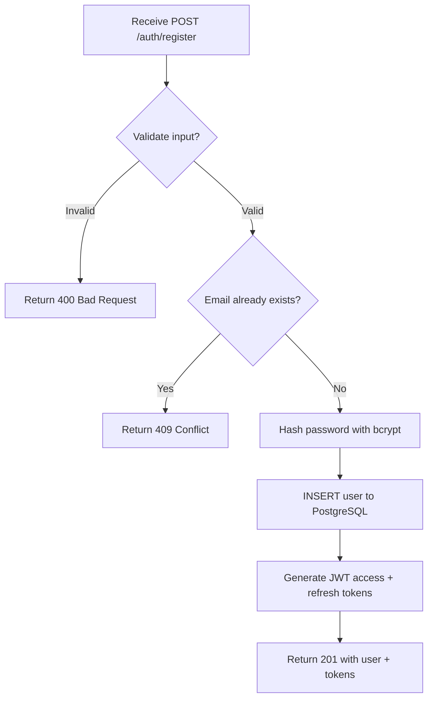

**friend-service — SendFriendRequest:**

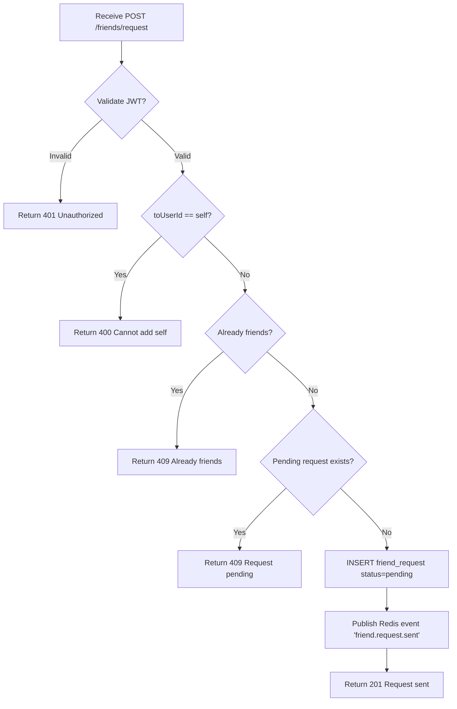

**post-service — CreatePost:**

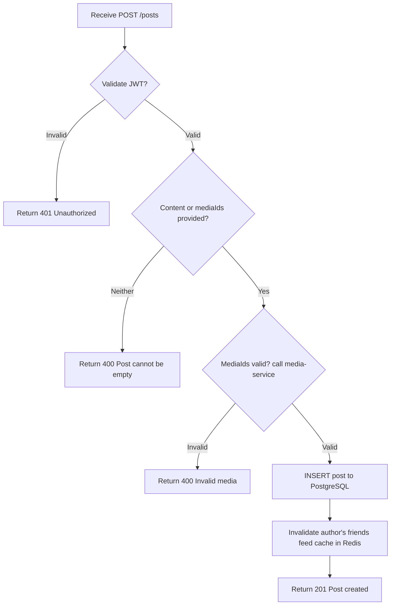

**chat-service — SendMessage (Socket.IO):**

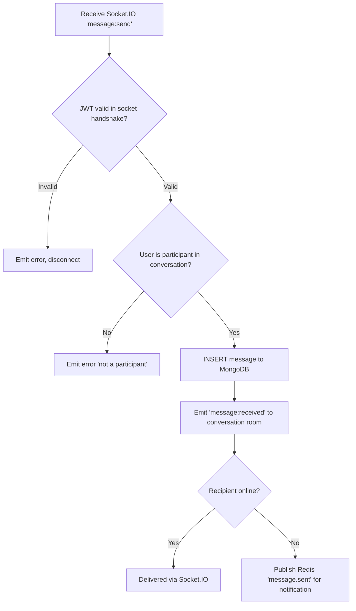

**media-service — UploadMedia:**

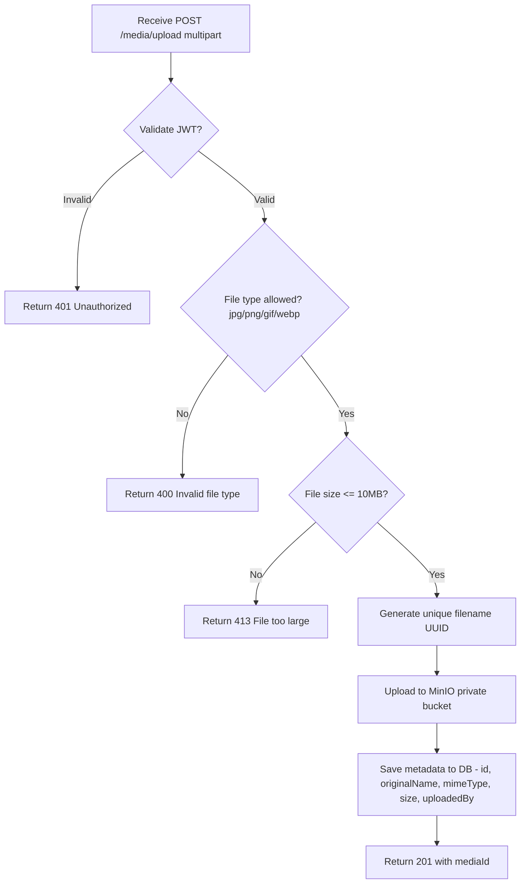

**notification-service — Event Handler:**

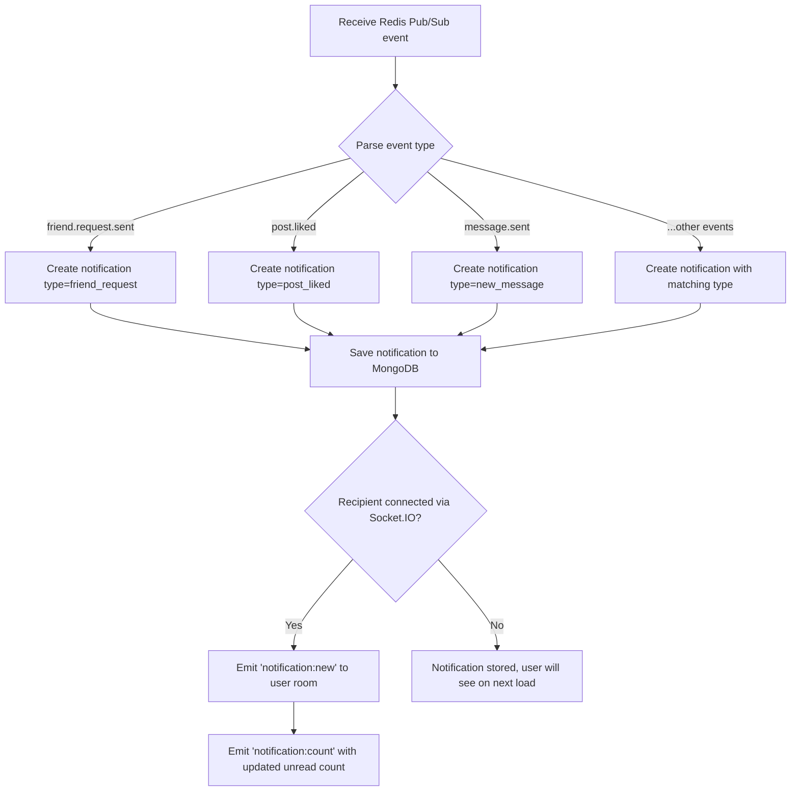
