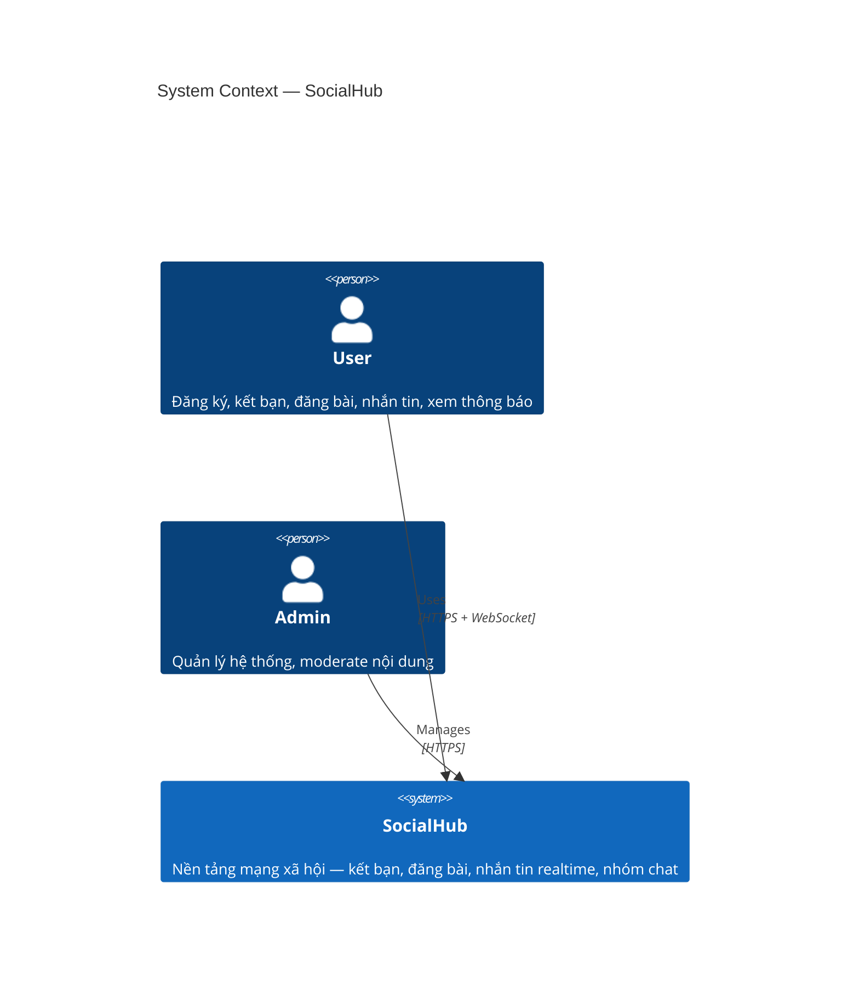
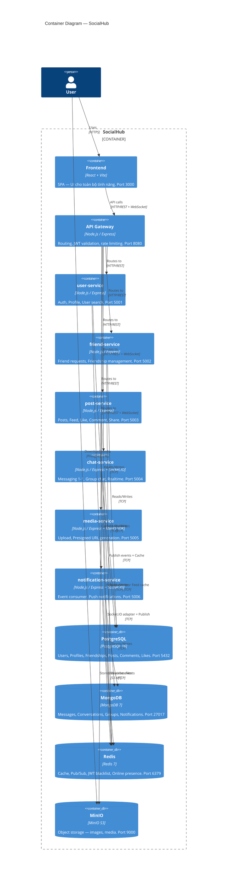
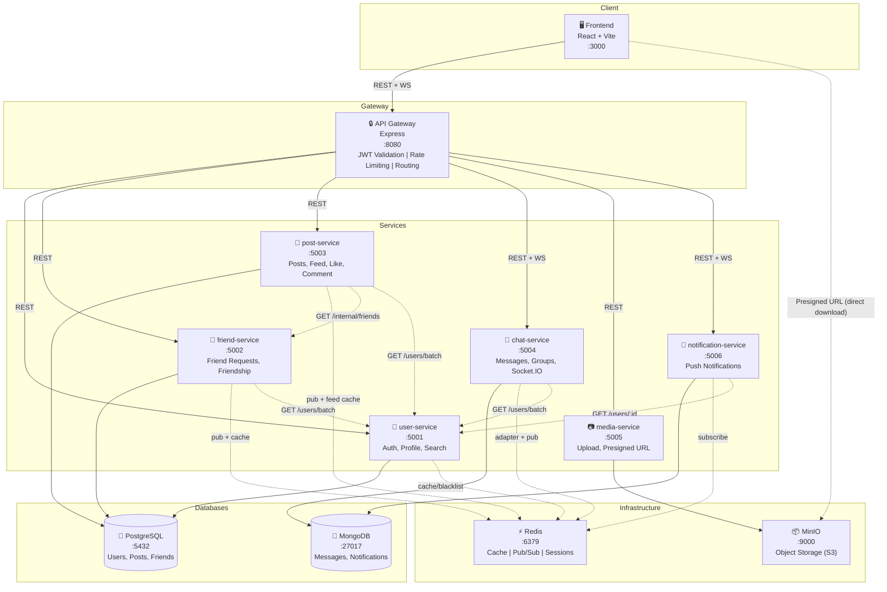

# System Architecture — SocialHub

> Tài liệu kiến trúc hệ thống cho **SocialHub** — nền tảng mạng xã hội.
> Được hoàn thành dựa trên kết quả phân tích DDD trong [analysis-and-design-ddd.md](analysis-and-design-ddd.md).
>
> **Inputs từ Analysis & Design:**
> - 6 Service Candidates (Bounded Contexts): user, friend, post, chat, media, notification
> - Service Composition diagrams (Flow 1–5)
> - Non-Functional Requirements (NFRs)
> - Service Contracts (API specs)

**References:**
1. *Service-Oriented Architecture: Analysis and Design for Services and Microservices* — Thomas Erl (2nd Edition)
2. *Microservices Patterns: With Examples in Java* — Chris Richardson
3. *Designing Data-Intensive Applications* — Martin Kleppmann

---

## 1. Pattern Selection

| Pattern | Selected? | Derived from (Analysis Step) | Business/Technical Justification |
|---------|-----------|------------------------------|----------------------------------|
| **API Gateway** | ✅ Yes | NFR 1.3 (Security), DDD 2.6 (Context Map) | Single entry point cho tất cả client requests. JWT validation tại gateway, rate limiting, routing tới 6 services. Frontend chỉ biết 1 endpoint. |
| **Database per Service** | ✅ Yes | DDD 2.5 (Bounded Contexts) | Mỗi service có database riêng — user/friend/post dùng PostgreSQL, chat/notification dùng MongoDB, media dùng MinIO. Đảm bảo loose coupling, independent deployment, data ownership. |
| **Event-driven / Pub-Sub** | ✅ Yes | DDD 2.6 (Context Map — async relationships), NFR 1.3 (Scalability) | Redis Pub/Sub cho cross-service events (notification triggers). Loose coupling — notification-service không cần biết chi tiết từng source service. |
| **CQRS (partial)** | ✅ Yes (Feed only) | DDD 2.7 (Flow 3 — Feed), NFR 1.3 (Performance) | Newsfeed đọc nhiều hơn ghi. Feed cache trong Redis (sorted set) tách biệt read path (cache) và write path (database). Không áp dụng full CQRS cho toàn hệ thống. |
| **Circuit Breaker** | ✅ Yes | NFR 1.3 (Availability) | Khi service downstream (ví dụ media-service) bị lỗi, circuit breaker ngăn cascade failure. Sử dụng library `opossum` (Node.js). |
| **Shared Database** | ❌ No | DDD 2.5 | Vi phạm bounded context boundaries. Mỗi service phải own data riêng. |
| **Saga** | ❌ No | — | Không có cross-service transaction phức tạp. Các operations đều idempotent và compensable tại service level. |
| **Service Registry / Discovery** | ❌ No | — | Sử dụng Docker Compose DNS — service names tự resolve. Không cần Consul/Eureka ở quy mô này. |

---

## 2. System Components

| Component | Responsibility | Tech Stack | Port |
|-----------|----------------|------------|------|
| **Frontend** | Single-page application — UI cho toàn bộ tính năng | React + Vite, Socket.IO Client | 3000 |
| **API Gateway** | Routing, JWT validation, rate limiting, CORS, request logging | Node.js (Express), express-http-proxy, jsonwebtoken | 8080 |
| **user-service** | Auth (register, login, JWT), profile management, user search | Node.js (Express), bcrypt, jsonwebtoken | 5001 |
| **friend-service** | Friend requests, friendship management, mutual friends, suggestions | Node.js (Express), ioredis (pub) | 5002 |
| **post-service** | Posts CRUD, like/comment, share, newsfeed (cached) | Node.js (Express), ioredis (pub + cache) | 5003 |
| **chat-service** | 1-1 messaging, group chat, realtime via Socket.IO | Node.js (Express), Socket.IO Server, @socket.io/redis-adapter | 5004 |
| **media-service** | File upload to MinIO, presigned URL generation, media metadata | Node.js (Express), minio (SDK), multer | 5005 |
| **notification-service** | Event consumption (Redis Sub), notification CRUD, realtime push | Node.js (Express), Socket.IO Server, ioredis (sub) | 5006 |
| **PostgreSQL** | Relational data: users, profiles, friendships, posts, comments, likes | PostgreSQL 16 Alpine | 5432 |
| **MongoDB** | Document data: messages, conversations, groups, notifications | MongoDB 7 | 27017 |
| **Redis** | Cache (feed, profile), pub/sub (events, Socket.IO adapter), JWT blacklist, online presence | Redis 7 Alpine | 6379 |
| **MinIO** | Object storage: images, avatars, media files. S3-compatible API. | MinIO (latest) | 9000 (API), 9001 (Console) |

---

## 3. Communication

### Inter-service Communication Matrix

| From → To | user-service | friend-service | post-service | chat-service | media-service | notification-service | Gateway | PostgreSQL | MongoDB | Redis | MinIO |
|-----------|-------------|----------------|-------------|-------------|--------------|---------------------|---------|-----------|---------|-------|-------|
| **Frontend** | — | — | — | WebSocket | — | WebSocket | REST | — | — | — | Presigned URL (GET) |
| **Gateway** | REST | REST | REST | REST + WebSocket proxy | REST | REST + WebSocket proxy | — | — | — | — | — |
| **user-service** | — | — | — | — | REST (get URL) | — | — | TCP | — | TCP (cache, blacklist) | — |
| **friend-service** | REST (get user info) | — | — | — | — | — | — | TCP | — | TCP (pub, cache) | — |
| **post-service** | REST (get user info) | REST (get friends) | — | — | REST (validate media) | — | — | TCP | — | TCP (pub, cache) | — |
| **chat-service** | REST (get user info) | — | — | — | REST (get URL) | — | — | — | TCP | TCP (adapter, pub) | — |
| **media-service** | — | — | — | — | — | — | — | — | — | — | S3 API (TCP) |
| **notification-service** | REST (get user info) | — | — | — | — | — | — | — | TCP | TCP (sub) | — |

**Communication Legend:**
- **REST**: Synchronous HTTP/JSON qua internal Docker network
- **WebSocket**: Socket.IO connection (chat + notifications realtime)
- **TCP**: Database protocol (PostgreSQL, MongoDB, Redis, MinIO S3)
- **Presigned URL (GET)**: Client tải ảnh trực tiếp từ MinIO bằng signed URL
- **pub/sub**: Redis Pub/Sub cho cross-service events

### Internal Service Communication (REST)

Các service gọi nhau qua internal REST API (không qua Gateway):

| Caller | Callee | Endpoint | Purpose |
|--------|--------|----------|---------|
| friend-service | user-service | `GET /users/batch` | Lấy thông tin users cho friend list display |
| post-service | user-service | `GET /users/batch` | Lấy author info cho posts |
| post-service | friend-service | `GET /internal/friends/:userId` | Lấy friend IDs để build newsfeed |
| post-service | media-service | `GET /media/:id` | Validate mediaIds khi tạo post |
| chat-service | user-service | `GET /users/batch` | Lấy participant info cho conversations |
| notification-service | user-service | `GET /users/:id` | Lấy display name cho notification message |

### Redis Pub/Sub Channels

| Channel | Publisher | Subscriber | Payload |
|---------|-----------|-----------|---------|
| `friend.request.sent` | friend-service | notification-service | `{fromUserId, toUserId, requestId}` |
| `friend.request.accepted` | friend-service | notification-service | `{fromUserId, toUserId}` |
| `post.liked` | post-service | notification-service | `{userId, postId, postAuthorId}` |
| `post.commented` | post-service | notification-service | `{userId, postId, postAuthorId, commentId}` |
| `post.shared` | post-service | notification-service | `{userId, postId, postAuthorId}` |
| `message.sent` | chat-service | notification-service | `{senderId, conversationId, recipientId}` |
| `group.member.added` | chat-service | notification-service | `{groupId, groupName, addedUserId, addedByUserId}` |

### Redis Cache Strategy

| Key Pattern | Data Structure | Service | TTL | Purpose |
|-------------|---------------|---------|-----|---------|
| `blacklist:{jti}` | STRING | user-service | Token remaining TTL | JWT blacklist khi logout |
| `user:{userId}` | HASH | user-service | 30 min | Profile cache — giảm DB reads |
| `friends:{userId}` | SET | friend-service | 15 min | Friend list cache — cho feed queries |
| `feed:{userId}` | SORTED SET | post-service | 10 min | Newsfeed cache — score = timestamp |
| `online:{userId}` | STRING | chat-service | 5 min + heartbeat | Online presence tracking |
| `ratelimit:{ip}:{endpoint}` | STRING (counter) | Gateway | 1 min | Rate limiting (sliding window) |

---

## 4. Architecture Diagram

### 4.1 System Context (C4 Level 1)

> SocialHub không tích hợp hệ thống bên ngoài (payment, email) ở phiên bản này. Tất cả components đều self-hosted.

### 4.2 Container Diagram (C4 Level 2) — Full Deployment View

### 4.3 Detailed Architecture Diagram

---

## 5. Deployment

### Docker Compose Configuration

- Tất cả services containerized với Docker
- Orchestrated via Docker Compose
- Single command: `docker compose up --build`
- Persistent data: PostgreSQL, MongoDB, Redis, MinIO dùng named volumes

**Service Communication Rules:**
- Frontend → Gateway: `http://gateway:8080` (Docker DNS)
- Gateway → Services: `http://user-service:5001`, `http://friend-service:5002`, etc.
- Services → Databases: `postgresql://pg:5432`, `mongodb://mongo:27017`, `redis://redis:6379`, `minio:9000`
- **Không bao giờ dùng `localhost` cho inter-service calls**

**Health Checks:**
- Tất cả services expose `GET /health` → `{"status": "ok"}`
- Docker Compose healthcheck cho infrastructure (PostgreSQL, MongoDB, Redis, MinIO)
- Gateway chỉ route khi downstream service healthy

**Docker Compose Services:**

| Service | Build Context | Exposed Port | Internal Port | Depends On |
|---------|--------------|-------------|--------------|------------|
| frontend | `./frontend` | 3000 | 3000 | gateway |
| gateway | `./gateway` | 8080 | 8000 | all services |
| user-service | `./services/user-service` | 5001 | 5000 | pg, redis |
| friend-service | `./services/friend-service` | 5002 | 5000 | pg, redis |
| post-service | `./services/post-service` | 5003 | 5000 | pg, redis |
| chat-service | `./services/chat-service` | 5004 | 5000 | mongo, redis |
| media-service | `./services/media-service` | 5005 | 5000 | minio |
| notification-service | `./services/notification-service` | 5006 | 5000 | mongo, redis |
| pg | `postgres:16-alpine` | 5432 | 5432 | — |
| mongo | `mongo:7` | 27017 | 27017 | — |
| redis | `redis:7-alpine` | 6379 | 6379 | — |
| minio | `minio/minio` | 9000, 9001 | 9000, 9001 | — |

---

## API Specification Formats

| Communication Style | Format | Location |
|---------------------|--------|----------|
| Synchronous REST (HTTP) | OpenAPI 3.0 YAML | `docs/api-specs/*.yaml` (6 files) |
| Realtime WebSocket (Socket.IO) | x-socketio-events extension in `chat-service.yaml` | `docs/api-specs/chat-service.yaml` |
| Async / Redis Pub/Sub | x-async-events extension in respective YAMLs | `docs/api-specs/notification-service.yaml` |

**API Spec Files:**
- [`user-service.yaml`](api-specs/user-service.yaml) — Auth, Profile, User search
- [`friend-service.yaml`](api-specs/friend-service.yaml) — Friend requests, Friendship
- [`post-service.yaml`](api-specs/post-service.yaml) — Posts, Feed, Like, Comment, Share
- [`chat-service.yaml`](api-specs/chat-service.yaml) — Messages, Groups, Socket.IO events
- [`media-service.yaml`](api-specs/media-service.yaml) — Upload, Presigned URL
- [`notification-service.yaml`](api-specs/notification-service.yaml) — Notifications, Redis Pub/Sub consumer
